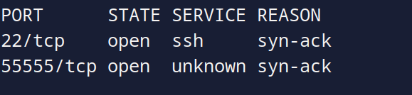
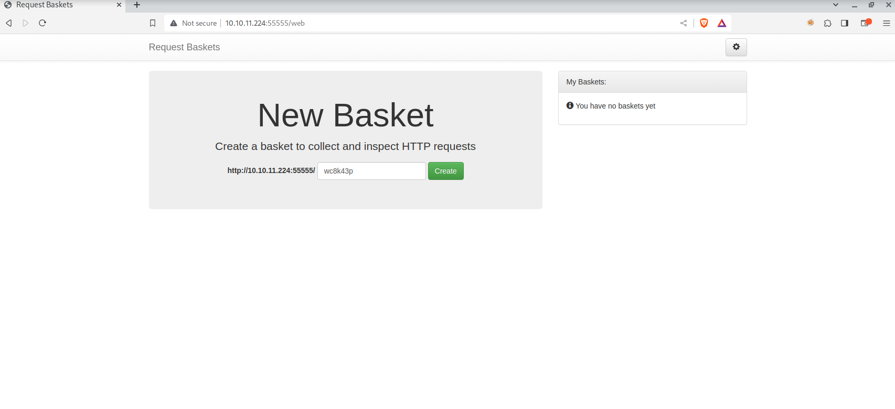
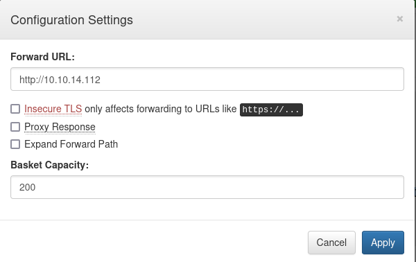
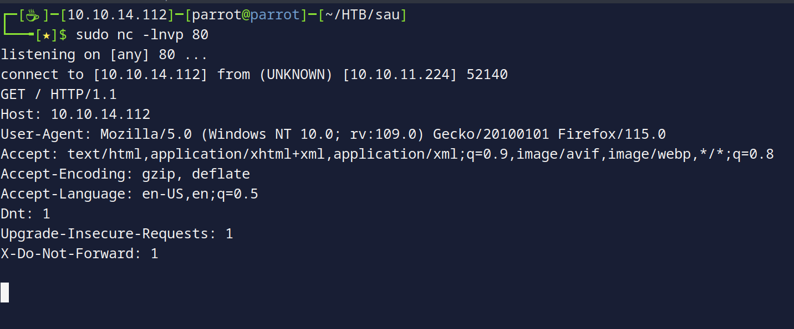
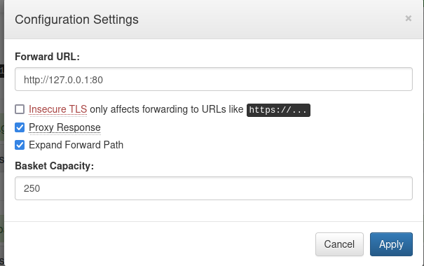
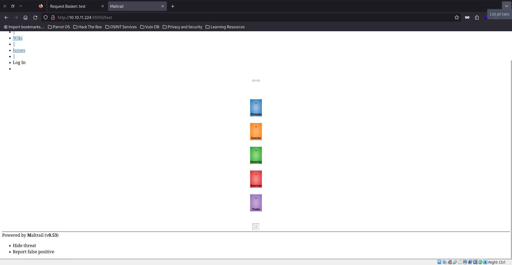
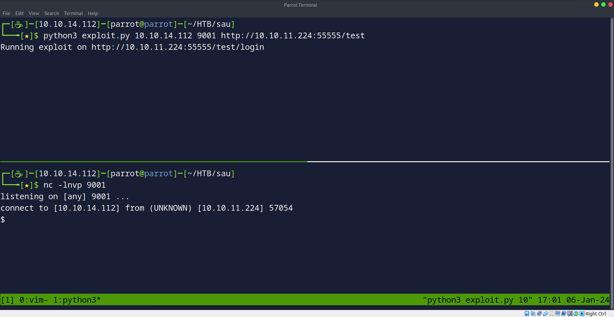
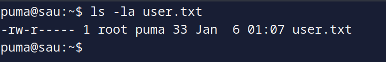
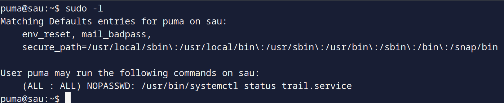
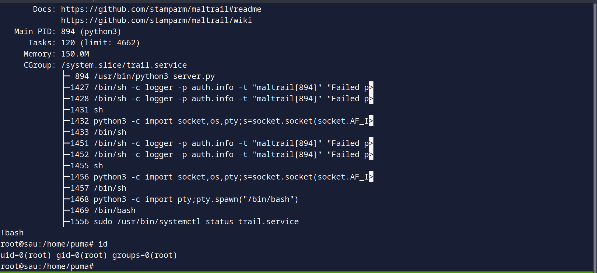

	

Let's start by enumerating the machines with nmap:
```
sudo nmap -sC -sV -oN inital.nmap 10.10.11.224
Nmap scan report for 10.10.11.224
Host is up (0.079s latency).
Not shown: 998 closed tcp ports (reset)
PORT   STATE    SERVICE VERSION
22/tcp open     ssh     OpenSSH 8.2p1 Ubuntu 4ubuntu0.7 (Ubuntu Linux; protocol 2.0)
| ssh-hostkey: 
|   3072 aa:88:67:d7:13:3d:08:3a:8a:ce:9d:c4:dd:f3:e1:ed (RSA)
|   256 ec:2e:b1:05:87:2a:0c:7d:b1:49:87:64:95:dc:8a:21 (ECDSA)
|_  256 b3:0c:47:fb:a2:f2:12:cc:ce:0b:58:82:0e:50:43:36 (ED25519)
80/tcp filtered http
Service Info: OS: Linux; CPE: cpe:/o:linux:linux_kernel

Service detection performed. Please report any incorrect results at https://nmap.org/submit/ .
Nmap done: 1 IP address (1 host up) scanned in 7.87 seconds
```

Seeing the result, we see that port 80 is filtered which means we cant access it from the outside, let's do a full port scan using (-p-), to see if there is more open ports.



Doing so, we see we have 55555 port open, let's try accessing it from the browser:



We see basket request service, with the version 1.2.1.

After searching and reading about baskets, we see that they are used to collect HTTP requests and inspecting them, but they are vulnerable to SSRF (server side request forgery) because the user can forward the response to where he wants, and this can give access to restricted service on the local network of the server.

Upon creating a basket, we can see that we can do some settings, one of them is the "forward url", which specifies the url that the requests are made to this basket should be forwarded to, in other words, where should the request go.



Let's try to make the request get forwarded to us, and let's open port 80 using netcat to test for connectivity:
So we set up our listener `sudo nc -lnvp 80`, then let's make a request to
`http://10.10.11.224:55555/<BASKET NAME>/anything`, and upon doing so:

So we got a connection back!

Remember that filtered 80 port? let's try to make the server request that website and see what can we get.

We will configure our basket as the following, then go to the basket url.



And now when we go there:



We see mailtrail with version 0.53 which is vulnerable to RCE, so time to get a shell on the box!

Upon searching we see it's vulnerable to command injection in the username field in the login, so we do it from the command line like this:
```
curl <BASKET URL> --data 'username=`COMMAND HERE`'
```
For ease of use, we will use a PoC from github, here's the [link](https://github.com/DcardosoGH/Maltrail-0.53-RCE-/blob/main/exploit.py).

We will pass our listening ip and port and send a connection, and we get a shell back!




And we got the user flag, time for root!

The first thing to check is `sudo -l`, when we do so, we see the following:



We can view a certain service status in systemctl, which is by default will use less to view data, and if you didn't know we can execute system commands in less!

So let's issue the command then:

When we view the page we will hit `!bash` and we will get a root shell:



And PWNED!

Thanks for reading.

Happy hacking :)